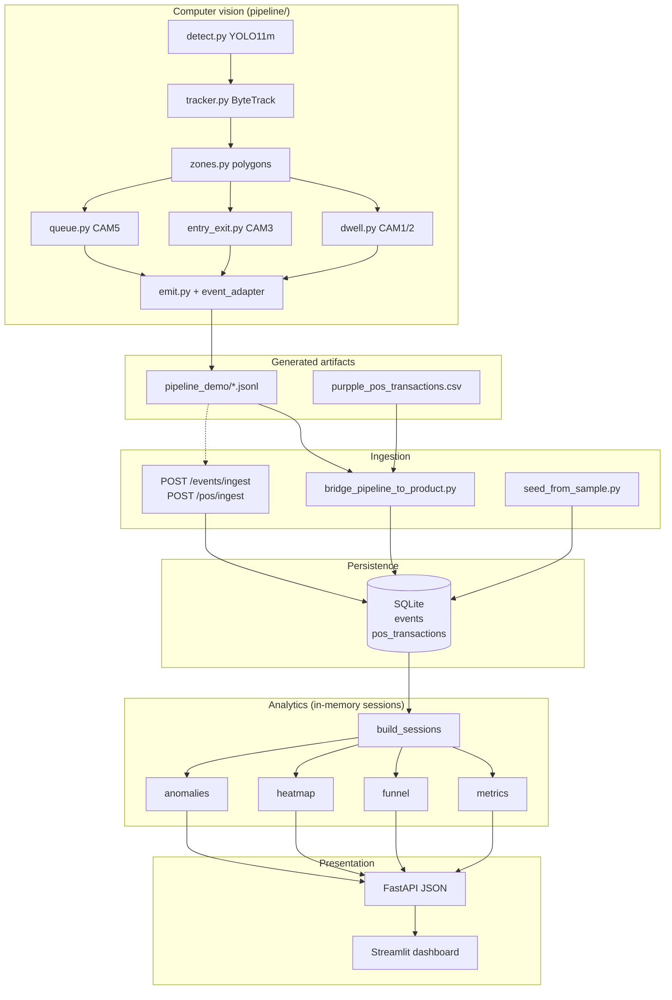

# Design Document — Purpple Vision

## 1. System overview

Purpple Vision is a **Store Intelligence System** for Apex Retail. Production flow:

**CCTV clips → Detection pipeline → JSON events → Intelligence API → Streamlit dashboard**

**North Star metric:**

```
Conversion Rate = Visitors who completed a purchase ÷ Total unique visitors
```

A visitor converts when they reached billing and `billing_activity_at` falls within **5 minutes before** a same-store POS transaction (`app/pos_correlation.py`).

---

## 2. System architecture



### Cross-cutting concerns

- **Logging:** JSON access logs via `RequestLoggingMiddleware` (`trace_id`, latency, `store_id`).
- **Errors:** Global handlers return structured `ErrorResponse` with HTTP 503 on database failures.
- **Health:** `GET /health` reports DB availability and per-store feed staleness.

---

## 3. Component breakdown

### 3.1 Detection pipeline (`pipeline/`)

| Module | Role | Status |
|--------|------|--------|
| `detect.py` | YOLO11m person detection | Implemented |
| `tracker.py` | ByteTrack multi-object tracking | Implemented |
| `zones.py` | Polygon overlap zone assignment | Implemented |
| `dwell.py` | ZONE_ENTER / EXIT / DWELL_COMPLETED (CAM1/2) | Implemented |
| `entry_exit.py` | ENTRY / EXIT / REENTRY line crossing (CAM3) | Implemented |
| `queue.py` | Queue + payment zone events (CAM5) | Implemented |
| `emit.py` | NOTEBK → Purpple JSONL via `event_adapter` | Implemented |
| `pos_loader.py` | Brigade CSV → invoice aggregation | Implemented |
| `purchase_matching.py` | Offline invoice ↔ CCTV matching | Implemented (not in API) |
| `staff.py` | Staff vs customer classification | **Stub** |
| `config.py` | Camera geometry, clip anchors, paths | Implemented |

Processors run frame-skipped inference (`PROCESS_EVERY_N_FRAMES = 10`) for performance parity across cameras.

### 3.2 Intelligence API (`app/`)

| Module | Responsibility |
|--------|----------------|
| `main.py` | FastAPI app, lifespan `init_db()`, middleware, exception handlers |
| `ingestion.py` | `POST /events/ingest` — batch 1–500, idempotent on `event_id` |
| `pos_ingestion.py` | `POST /pos/ingest` — idempotent on `transaction_id` |
| `sessions.py` | Session lifecycle ENTRY/REENTRY → EXIT |
| `pos_correlation.py` | Billing ↔ POS 5-minute window |
| `metrics.py` | `GET /stores/{id}/metrics` |
| `funnel.py` | `GET /stores/{id}/funnel` |
| `heatmap.py` | `GET /stores/{id}/heatmap` |
| `anomalies.py` | `GET /stores/{id}/anomalies` |
| `health.py` | `GET /health` |

All store analytics accept optional `?date=YYYY-MM-DD` (UTC day; default today).

### 3.3 Data layer (`app/db.py`)

- **Engine:** SQLite at `./data/store_intelligence.db` (`DATABASE_URL` override).
- **Tables:** `events` (PK `event_id`), `pos_transactions` (PK `transaction_id`).
- **Sessions:** Derived at query time — no `visitor_sessions` table.
- **Init:** `init_db()` on startup; no Alembic migrations.

### 3.4 Dashboard (`dashboard/`)

- **`streamlit_app.py`:** Calls FastAPI only (no direct SQLite). KPIs, funnel, heatmap, anomalies; empty-state when `total_sessions = 0`.
- **`terminal_dashboard.py`:** Stub (planned `rich` alternative).
- **Docker:** Optional `dashboard` compose profile on port 8501.

---

## 4. Event schema

Defined in `app/models.py` (`Event`, `EventType`):

**Types:** ENTRY, EXIT, REENTRY, ZONE_ENTER, ZONE_EXIT, ZONE_DWELL (≥30s), BILLING_QUEUE_JOIN (`metadata.queue_depth > 0`), BILLING_QUEUE_ABANDON.

**Rules:** Zone required/absent per event type; UUID v4 `event_id`; UTC timestamps; low-confidence events retained (not dropped).

Pipeline NOTEBK types map via `pipeline/event_adapter.py` (e.g. `DWELL_COMPLETED` → `ZONE_DWELL`, `QUEUE_ENTER` → `BILLING_QUEUE_JOIN`).

---

## 5. Session engine

Implemented in `app/sessions.py`:

| Rule | Behavior |
|------|----------|
| Open | ENTRY or REENTRY |
| Close | EXIT |
| Orphan zone/queue events | Ignored (no open session) |
| REENTRY | New session; unique visitor count unchanged |
| Staff | Sessions built; excluded via `customer_sessions()` |
| Billing | `BILLING` zone or queue events set `reached_billing` |

Session fields: `zones_visited`, `joined_queue`, `abandoned_queue`, `billing_activity_at`, `total_dwell_ms_by_zone`.

---

## 6. Analytics summary

| Endpoint | Core logic |
|----------|------------|
| **Metrics** | Unique visitors, conversion, dwell, queue abandonment, billing reach, session count |
| **Funnel** | Visitor-level: unique → any zone → billing queue → converted; drop-off % |
| **Heatmap** | Per-zone visits, dwell, engagement score normalized 0–100 vs peak zone |
| **Anomalies** | Queue spike, conversion drop, dead zone (fixed thresholds) |

**Funnel stages:** `unique_visitors` → `reached_any_zone` → `billing_queue` → `converted_visitors`

**Heatmap confidence:** `data_confidence = true` when ≥ 20 customer sessions on the requested day.

---

## 7. Data flow

1. Pipeline processors emit NOTEBK JSONL; `PipelineEmitter` writes Purpple-schema JSONL.
2. `scripts/bridge_pipeline_to_product.py` or `POST /events/ingest` persists events.
3. POS via `pos_loader` → CSV → bridge or `POST /pos/ingest`.
4. Analytics endpoints load day-scoped rows, call `build_sessions()`, compute metrics.
5. Streamlit fetches JSON from GET endpoints.

---

## 8. Deployment

- **Dockerfile:** `uvicorn app.main:app --host 0.0.0.0 --port 8000`
- **Compose:** Bind-mounts `./data`, `./logs`; healthcheck on `/health`
- **Environment:** `DATABASE_URL`, `LOG_LEVEL`, `LOG_FORMAT`, `STALE_FEED_THRESHOLD_MINUTES` — defaults inline (no mandatory `.env`)

---

## 9. Testing

- **Framework:** pytest — **125 tests**, ~95% coverage on `app/`
- **Suites:** sessions, ingestion, POS, metrics, funnel, heatmap, anomalies, health, edge cases, seed
- **Gap:** No `test_pipeline.py`; `tests/assertions.py` is a stub

---

## 10. Design decisions and technology choices

*Merged from the former `CHOICES.md` document.*

### 10.1 Detection model

| Option | Assessment |
|--------|------------|
| YOLOv8/v9/v10, RT-DETR, MediaPipe | Evaluated |

**Choice:** **YOLO11m + ByteTrack** (`pipeline/detect.py`, `pipeline/tracker.py`).

**Rationale:** Pre-trained COCO weights, CPU-viable inference, bounding boxes for zone polygons and line crossing. Part A rewards edge-case handling over SOTA mAP; API delivery was prioritized in the time box. Dependencies pinned in `requirements.txt` (`ultralytics`, `opencv-python-headless`, `lapx`).

### 10.2 Event schema and session model

| Option | Assessment |
|--------|------------|
| Flat events only, session-aggregated only, hybrid | Hybrid selected |

**Choice:** Persist immutable events in SQLite; derive `VisitorSession` in memory via `build_sessions()`.

**Rationale:** Idempotent ingest on `event_id`; full history for heatmap and queue counts; centralized REENTRY and orphan rules. Trade-off: sessions recomputed per request (acceptable for day-scoped SQLite queries).

### 10.3 API storage and framework

**Choice:** **SQLite** + SQLAlchemy 2.0 sync + **FastAPI** domain routers.

**Rationale:** Single-file DB, no extra container, survives Docker restarts via bind mount. POS and events share one store for correlation. Global 503 handlers and structured logging for production readiness.

### 10.4 POS conversion window

**Choice:** `transaction.timestamp − 5min ≤ billing_activity_at ≤ transaction.timestamp`

Matches challenge PDF: visitor in billing within five minutes before POS swipe.

### 10.5 Anomaly detection

**Choice:** Fixed daily thresholds in `app/anomalies.py` (queue joins ≥10/≥20, conversion <20%/<10%, heatmap score <20/<10).

**Rationale:** Testable without seeding seven days of history. Rolling baselines deferred.

### 10.6 Structured logging

**Choice:** JSON middleware logs — `trace_id`, `endpoint`, `latency_ms`, `status_code`, optional `store_id`, `event_count` on ingest routes.

### 10.7 Staff exclusion

**Choice:** `is_staff` on events; `customer_sessions()` filters staff from customer metrics. Pipeline `staff.py` not yet implemented — flag defaults from pipeline emitters.

### 10.8 Heatmap normalization

**Choice:** `engagement_score = visit_count + total_dwell_ms/1000`; highest zone = 100.

### 10.9 Seed and bridge workflows

**Choice:** `seed_from_sample.py` for challenge-format files; `bridge_pipeline_to_product.py` for generated pipeline demo artifacts (uses same ingest functions as HTTP).

---

## 11. Tradeoffs

| Decision | Benefit | Cost |
|----------|---------|------|
| In-memory sessions | Simple schema, idempotent ingest | Full event scan per analytics request |
| SQLite | Zero-ops deployment | Limited concurrent write throughput |
| Fixed anomaly thresholds | Works day one | Not PDF-perfect rolling baselines |
| Per-camera track IDs | Simple pipeline | No cross-camera visitor fusion |
| Frame skipping (every 10th) | Faster multi-camera runs | May miss brief zone crossings |
| Offline purchase matching | Rich validation reports | Not exposed via API |
| Streamlit over custom React | Fast bonus delivery | Revenue KPI limited (no API field) |

---

## 12. Assumptions

1. **UTC calendar days** scope all store analytics queries.
2. **One store_id** per request; multi-store supported via separate calls.
3. **CCTV clip start times** in `pipeline/config.py` anchor event timestamps.
4. **Brigade Bangalore dataset** layout matches normalized polygons in config.
5. **POS correlation** requires `billing_activity_at` from billing-zone or queue events inside an open session.
6. **Sessions open only on ENTRY/REENTRY** — zone-only events cannot create sessions.
7. **Evaluator can provide** CCTV/POS under `./data/` or use ingest/seed paths.
8. **Python 3.11** — dependencies not validated on 3.12+.

---

## 13. Known limitations

1. **CAM3/CAM5 demo outputs empty** on last run — 0 ENTRY events → 0 sessions despite 66 zone events ingested.
2. **No cross-camera ReID** — CAM1 `VIS_*` ≠ CAM3 `VIS_*`.
3. **Staff classification stub** — `pipeline/staff.py` not implemented.
4. **Anomalies:** no 7-day rolling conversion baseline or 30-minute dead-zone timer per PDF wording.
5. **No daily revenue GET endpoint** — dashboard shows em dash for Revenue KPI.
6. **Purchase matches** — offline JSON only; not in SQLite or API.
7. **Pipeline not auto-wired** to HTTP ingest — manual bridge step after demo run.
8. **`run_pipeline.sh`** — bash skeleton only.
9. **CCTV vs POS time mismatch** in demo clips — purchase matching returns 0 matches.
10. **Heatmap unreliable** below 20 customer sessions (`data_confidence: false`).

Historical analysis: [docs/archive/final_session_gap_report.md](docs/archive/final_session_gap_report.md), [docs/archive/project_completion_report.md](docs/archive/project_completion_report.md).

---

## 14. AI-assisted decisions

1. **In-memory sessions vs persisted table** — reduced schema complexity for hackathon scope.
2. **Visitor-level funnel** — REENTRY does not double-count unique visitors; drop-off = `(prior − current) / prior × 100`.
3. **Deterministic anomaly thresholds** — deliver signals without multi-day seed data.
4. **Docker without mandatory `.env`** — clean-clone `docker compose up` acceptance gate.

---

## 15. Decision summary

| Area | Decision | Status |
|------|----------|--------|
| Detection | YOLO11m + ByteTrack | Implemented |
| Events + sessions | Hybrid persist + derive | Implemented |
| Database | SQLite + SQLAlchemy | Implemented |
| API | FastAPI domain routers | Implemented |
| Anomalies | Fixed thresholds | Implemented |
| Logging | JSON middleware | Implemented |
| Dashboard | Streamlit → API | Implemented |
| Staff CV | Uniform/heuristic | Stub |
| Purchase matching API | — | Not implemented |
