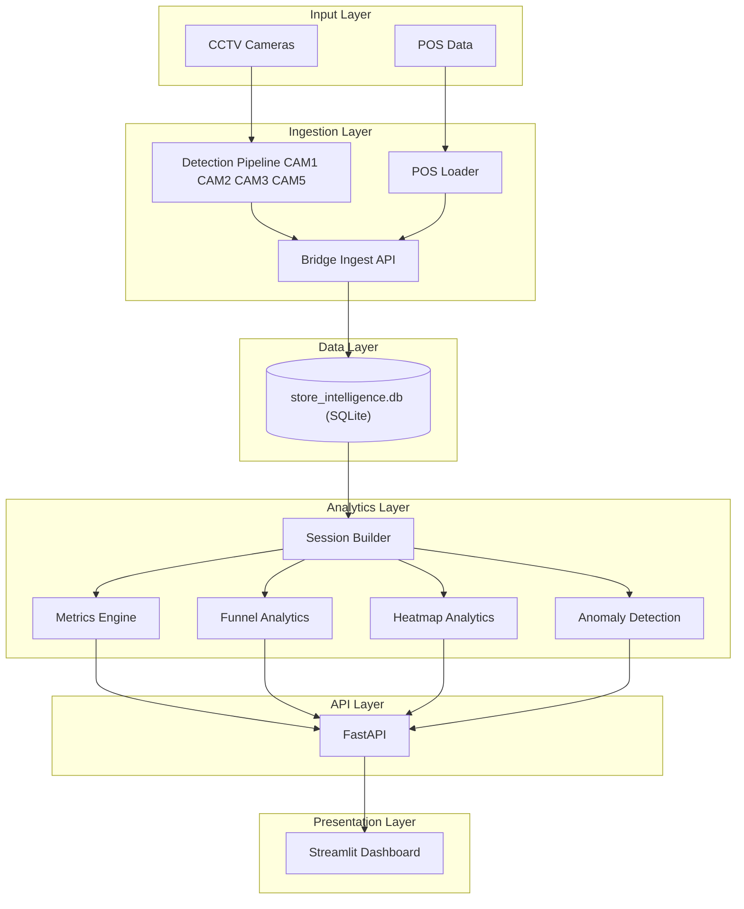
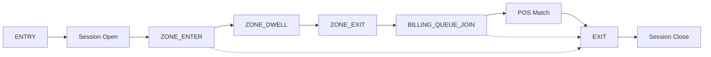

# System Architecture — Purpple Vision

## End-to-end flow

> Source: [architecture/system_architecture.md](architecture/system_architecture.md)



> **Session Builder** is the foundational analytics component. Visitor sessions are constructed from ENTRY, EXIT, REENTRY, zone, billing, and POS events. Funnel, heatmap, anomaly, and KPI calculations operate on these constructed sessions.

Full layer details and camera roles: [architecture/system_architecture.md](architecture/system_architecture.md).

**North Star metric:**

```
Conversion Rate = Visitors who completed a purchase ÷ Total unique visitors
```

A visitor converts when billing activity occurred within **5 minutes before** a POS transaction timestamp (`app/pos_correlation.py`).

---

## Detection Layer

| Camera | Module | Events produced | Business meaning |
|--------|--------|-----------------|------------------|
| **CAM1** | `cam1_processor` / `dwell.py` | ZONE_ENTER, ZONE_EXIT, ZONE_DWELL | Shelf engagement — left wall brands |
| **CAM2** | `cam2_processor` / `dwell.py` | ZONE_ENTER, ZONE_EXIT, ZONE_DWELL | Shelf engagement — right wall (LAKME, etc.) |
| **CAM3** | `entry_exit.py` | ENTRY, EXIT, REENTRY | Store doorway — **opens/closes sessions** |
| **CAM5** | `queue.py` | BILLING_QUEUE_JOIN, BILLING_QUEUE_ABANDON | Billing queue depth and abandonment |

Shared stack: **YOLO11m** person detection + **ByteTrack** tracking + polygon zone overlap (`zones.py`). NOTEBK-shaped events adapt to Purpple schema via `event_adapter.py` / `emit.py`.

**POS pipeline:** `pos_loader.py` aggregates Brigade line-item CSV → invoice-level JSON + Purpple POS CSV.

**Offline validation:** `purchase_matching.py` correlates invoices to CCTV events by time window (not exposed via API).

---

## Event Schema

Defined in `app/models.py`. Full reference: [architecture/event_schema.md](architecture/event_schema.md).

| Type | When emitted | zone_id |
|------|--------------|---------|
| **ENTRY** | Cross entry threshold inbound | null |
| **EXIT** | Cross entry threshold outbound | null |
| **REENTRY** | Same visitor after prior EXIT | null |
| **ZONE_ENTER** | Enter named product zone | required |
| **ZONE_EXIT** | Leave product zone | required |
| **ZONE_DWELL** | Continued dwell (≥30s cadence) | required |
| **BILLING_QUEUE_JOIN** | Join billing queue | BILLING + `metadata.queue_depth` |
| **BILLING_QUEUE_ABANDON** | Leave queue without purchase | BILLING |

Rules: UUID v4 `event_id`; UTC timestamps; staff flagged via `is_staff`; low-confidence events retained.

---

## Session Construction

Implemented in `app/sessions.py` — **derived at query time**, not persisted.

> Source: [architecture/session_lifecycle.md](architecture/session_lifecycle.md)



| Rule | Behavior |
|------|----------|
| Open session | ENTRY or REENTRY |
| Close session | EXIT |
| Orphan zone/queue events | Ignored (no open session) |
| REENTRY | New session; **unique visitor count unchanged** |
| Staff | Sessions built; excluded via `customer_sessions()` |
| Billing | BILLING zone or queue events set `reached_billing` and `billing_activity_at` |

Session fields: `zones_visited`, `joined_queue`, `abandoned_queue`, `total_dwell_ms_by_zone`.

**Critical for reviewers:** Zone-only events (CAM1/CAM2 without CAM3 ENTRY) produce **zero sessions**.

---

## POS Correlation

`app/pos_correlation.py`:

```
transaction.timestamp − 5min ≤ billing_activity_at ≤ transaction.timestamp
```

- Billing activity = BILLING zone visit or BILLING_QUEUE_JOIN inside an open customer session.
- Staff sessions never convert.
- Visitor with multiple sessions counts once in funnel if any session converts.

---

## Funnel Computation

`GET /stores/{id}/funnel` — **visitor-level**, not session double-count.

| Stage | Key | Meaning |
|-------|-----|---------|
| Entry | `unique_visitors` | Distinct visitors with ENTRY/REENTRY |
| Engaged | `reached_any_zone` | Entered any product zone |
| Billing | `billing_queue` | Joined billing queue |
| Purchase | `converted_visitors` | POS-correlated purchase |

Drop-off % = `(prior_stage − current) / prior × 100`.

---

## Heatmap Computation

`GET /stores/{id}/heatmap`:

- Per zone: visit count, unique visitors, total/average dwell.
- **Engagement score** = visit_count + total_dwell_ms/1000; highest zone normalized to **100**.
- **`data_confidence`:** `true` when ≥ 20 customer sessions on the UTC day; otherwise LOW confidence flag.

---

## Anomaly Detection

`GET /stores/{id}/anomalies` — fixed daily thresholds (`app/anomalies.py`):

| Type | Trigger | Severity |
|------|---------|----------|
| **QUEUE_SPIKE** | Queue joins exceed threshold | WARN / CRITICAL |
| **CONVERSION_DROP** | Conversion below threshold with billing traffic | WARN / CRITICAL |
| **DEAD_ZONE** | Zone normalized score below threshold | INFO / WARN |

Each anomaly includes `suggested_action` for store staff.

---

## Health Monitoring

`GET /health`:

| Field | Meaning |
|-------|---------|
| `status` | `ok` or `degraded` |
| `database_available` | SQLite reachable |
| `stores[].last_event_at` | Latest ingested event timestamp |
| `stores[].stale` | Feed lag exceeds threshold (default 10 min) |
| `warnings` | Includes `STALE_FEED: {store_id}` when stale |

---

## Data layer

- **Default DB:** `data/databases/store_intelligence.db`
- **Tables:** `events`, `pos_transactions`
- **Demo DBs:** `demo_product.db`, `demo_validation.db`, `test_api.db`
- **Synthetic validation:** `data/synthetic/demo_events.jsonl` + `demo_pos.csv`

---

## AI-Assisted Decisions

| Area | AI role | Human override |
|------|---------|----------------|
| Detection stack | Recommended YOLO + ByteTrack for hackathon scope | Chose YOLO11m over v8n; frame-skip every 10th frame |
| Session model | Suggested in-memory derivation vs persisted table | Accepted — simpler idempotent ingest |
| Funnel semantics | Clarified visitor-level dedup for REENTRY | Implemented in `funnel.py` |
| Anomaly baselines | Proposed rolling 7-day windows | **Rejected** for time box — fixed thresholds instead |
| Dashboard layout | Gap analysis vs challenge PDF | Presentation-only improvements, no API changes |
| Documentation | Structure and reviewer-first README | Human review of all technical claims |

Details: [CHOICES.md](CHOICES.md)

---

## Deployment

```powershell
docker compose up --build
```

Optional dashboard profile: `docker compose --profile dashboard up`

Environment: `DATABASE_URL`, `LOG_LEVEL`, `STALE_FEED_THRESHOLD_MINUTES`

---

## Testing

- **126 pytest tests**, ~95% coverage on `app/`
- Suites: sessions, ingestion, POS, metrics, funnel, heatmap, anomalies, health, edge cases

---

## Known limitations

1. CAM3/CAM5 demo outputs may be empty on Brigade clips → 0 sessions with zone-only data.
2. No cross-camera ReID — per-camera track IDs.
3. Staff classification stub (`pipeline/staff.py`).
4. Anomalies use fixed thresholds, not PDF 7-day rolling baselines.
5. Purchase matching is offline JSON only.
6. Real-time WebSocket updates not implemented.

---

## Related documents

- [CHOICES.md](CHOICES.md) — engineering decisions
- [architecture/pipeline_flow.md](architecture/pipeline_flow.md) — data flows
- [architecture/api_reference.md](architecture/api_reference.md) — HTTP API
- [architecture/system_architecture.md](architecture/system_architecture.md) — layered architecture
- [architecture/session_lifecycle.md](architecture/session_lifecycle.md) — session lifecycle
- [PROJECT_STATUS.md](PROJECT_STATUS.md) — completion checklist
