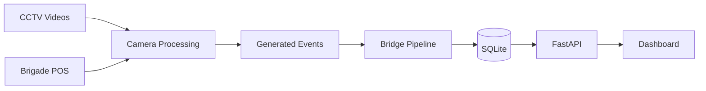
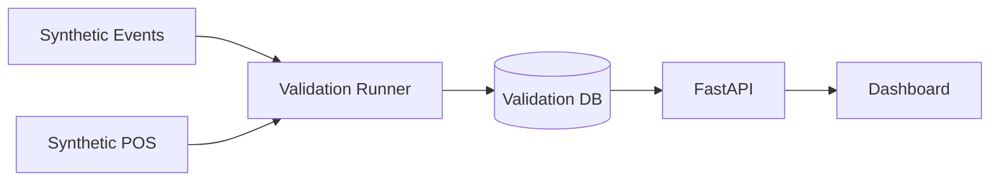

# Pipeline Data Flow

Two flows: **real Brigade CCTV pipeline** and **synthetic validation**.

Diagram sources: [validation_flow.md](validation_flow.md) · [system_architecture.md](system_architecture.md)

---

## Real data flow



### Orchestration commands

| Command | Scope |
|---------|-------|
| `python -m pipeline.cam1_processor` | Single camera |
| `python scripts/run_pipeline_demo.py` | CAM1 + CAM2 + CAM3 + CAM5 |
| `python scripts/demo_runner.py` | Full workflow + validation |
| `python scripts/bridge_pipeline_to_product.py` | JSONL → SQLite + analytics report |

### Step details

| Step | Location |
|------|----------|
| CCTV Videos | `data/cctv/Brigade_Bangalore/*.mp4` |
| Brigade POS | `data/pos/` |
| Generated Events | `data/outputs/pipeline/pipeline_demo/` |
| Bridge Pipeline | `scripts/bridge_pipeline_to_product.py` |
| SQLite | `data/databases/store_intelligence.db` |

### Offline branch (not in API)

```
pipeline_demo/*.notbk.jsonl + aggregated_transactions.json
    → pipeline/purchase_matching.py
    → data/outputs/purchase_matching/purchase_matches.json
```

---

## Validation flow

Deterministic proof that analytics work when **ENTRY events exist**:

> Source: [validation_flow.md](validation_flow.md)



### Expected validation results

| Metric | Value |
|--------|-------|
| Unique visitors | 3 |
| Sessions | 3 |
| Converted | 2 |
| Revenue (INR) | 2,148.50 |
| Conversion rate | 66.7% |

Report: [../reports/demo_validation_report.md](../reports/demo_validation_report.md)

---

## File naming conventions

| Pattern | Meaning |
|---------|---------|
| `camN_events.jsonl` | Purpple-schema events for camera N |
| `camN_events.notbk.jsonl` | Raw NOTEBK mirror (purchase matching input) |
| `purpple_pos_transactions.csv` | API-compatible POS for bridge/ingest |
| `purchase_matches.json` | Offline invoice ↔ CCTV correlation results |

---

## Related

- [event_schema.md](event_schema.md)
- [api_reference.md](api_reference.md)
- [validation_flow.md](validation_flow.md)
- [system_architecture.md](system_architecture.md)
- [../DESIGN.md](../DESIGN.md)
