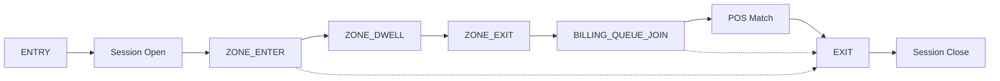

# Session Lifecycle

How a single customer visit becomes a measurable session from ENTRY to EXIT.

Sessions are **derived at query time** in `app/sessions.py` — not persisted as a separate table.

Dotted lines: customer may EXIT early without reaching billing or purchase.

## Stage summary

| Stage | Event / step | Business meaning |
|-------|--------------|------------------|
| **ENTRY** | ENTRY or REENTRY | Customer crosses the store entry line |
| **Session Open** | Session created | Visit tracking begins; REENTRY opens a new session without double-counting unique visitors |
| **ZONE_ENTER** | Zone entry | Customer enters a product zone |
| **ZONE_DWELL** | Dwell completed | Time spent browsing in the zone is recorded |
| **ZONE_EXIT** | Zone exit | Customer leaves the product zone |
| **BILLING_QUEUE_JOIN** | Queue join | Customer enters the billing queue; sets billing activity timestamp |
| **POS Match** | POS correlation | Purchase linked when billing activity occurred within 5 minutes before transaction |
| **EXIT** | EXIT event | Customer leaves the store |
| **Session Close** | Session closed | Visit complete; conversion flag set if POS matched |

## Orphan events

Zone and billing events **without a prior ENTRY** are ignored — this is why CAM1/CAM2-only pipeline output produces zero sessions.

## Related

- [../DESIGN.md](../DESIGN.md)
- [../architecture/event_schema.md](../architecture/event_schema.md)
