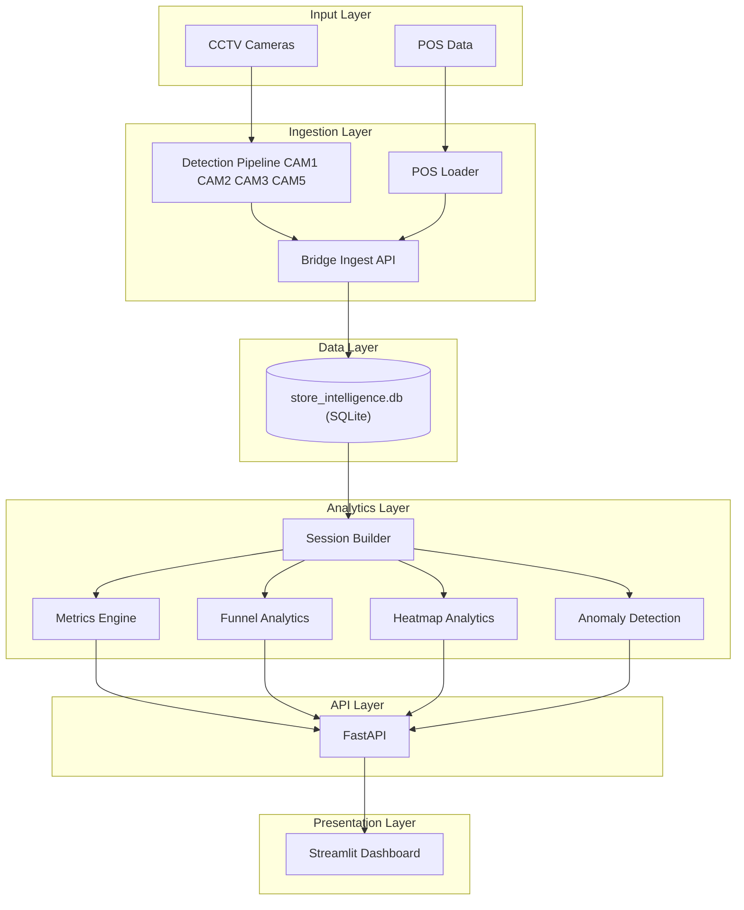

# Overall System Architecture

End-to-end Store Intelligence platform from CCTV capture to the Streamlit reviewer dashboard.

> **Session Builder** is the foundational analytics component. Visitor sessions are constructed from ENTRY, EXIT, REENTRY, zone, billing, and POS events. Funnel, heatmap, anomaly, and KPI calculations operate on these constructed sessions.

## Architecture rationale

- **CCTV and POS** are the two primary data sources — video drives behavioural events; POS records sales outcomes.
- **Detection pipelines** (CAM1, CAM2, CAM3, CAM5) and the **POS loader** generate schema-validated outputs that the **bridge / ingest API** loads into SQLite.
- **Session Builder** (`app/sessions.py`) derives customer journeys from ingested events; without ENTRY events, downstream KPIs remain empty.
- **Metrics, funnel, heatmap, and anomaly** modules each read sessions (and POS where needed) to compute store KPIs — they do not replace session construction.
- **FastAPI** exposes analytics over HTTP; the **Streamlit dashboard** consumes those endpoints only (no direct database access).

## Layer summary

| Layer | Components | Details |
|-------|------------|---------|
| **Input Layer** | CCTV Cameras, POS Data | MP4 clips in `data/cctv/`; Brigade CSV in `data/pos/` |
| **Ingestion Layer** | Detection Pipeline (CAM1–CAM5), POS Loader, Bridge / Ingest API | `pipeline/cam*_processor`, `entry_exit`, `queue`, `pos_loader`; `bridge_pipeline_to_product.py` or `POST /events/ingest` and `POST /pos/ingest` |
| **Data Layer** | store_intelligence.db (SQLite) | `data/databases/store_intelligence.db` — `events` and `pos_transactions` tables |
| **Analytics Layer** | Session Builder → Metrics Engine, Funnel Analytics, Heatmap Analytics, Anomaly Detection | Sessions derived at query time; `app/metrics.py`, `app/funnel.py`, `app/heatmap.py`, `app/anomalies.py` |
| **API Layer** | FastAPI | REST endpoints on port 8000 |
| **Presentation Layer** | Streamlit Dashboard | `dashboard/streamlit_app.py` — calls FastAPI on port 8501 |

## Camera roles

| Camera | Module | Role |
|--------|--------|------|
| CAM1 | `cam1_processor` | Shelf zones — left wall |
| CAM2 | `cam2_processor` | Shelf zones — right wall |
| CAM3 | `entry_exit` | Entry and exit — opens and closes sessions |
| CAM5 | `queue` | Billing queue depth and abandonment |

## Related

- [../DESIGN.md](../DESIGN.md)
- [pipeline_flow.md](pipeline_flow.md)
- [event_schema.md](event_schema.md)
- [validation_flow.md](validation_flow.md)
