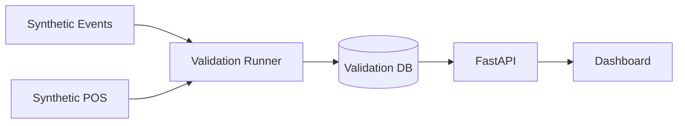

# Validation Flow

Deterministic synthetic dataset proving sessions, funnel, and revenue KPIs when **ENTRY events exist**.

Uses an **isolated database** — production `store_intelligence.db` is never modified.



## Step details

| Step | What happens | Location |
|------|--------------|----------|
| **Synthetic Events** | ENTRY-based demo event file | `data/synthetic/demo_events.jsonl` |
| **Synthetic POS** | Two matching POS transactions | `data/synthetic/demo_pos.csv` |
| **Validation Runner** | Ingest, compute analytics, write report | `scripts/demo_validation_run.py` |
| **Validation DB** | Per-store isolated SQLite | `store_1_validation.db`, `store_2_validation.db` |
| **FastAPI** | Serves computed KPIs (optional) | Port 8000 |
| **Dashboard** | Store 1 → 2026-06-01; Store 2 → 2026-04-10 | Streamlit port 8501 |

## Expected results

| Metric | Value |
|--------|-------|
| Unique visitors | 3 |
| Sessions | 3 |
| Converted | 2 |
| Revenue (INR) | 2,148.50 |
| Conversion rate | 66.7% |

## Run commands

```powershell
python scripts/demo_validation_run.py --store all
streamlit run dashboard/streamlit_app.py
```

See [../SUBMISSION.md](../SUBMISSION.md) for full reviewer commands.

Reports: [../reports/demo_validation_report_store_1.md](../reports/demo_validation_report_store_1.md), [store_2](../reports/demo_validation_report_store_2.md)

## Related

- [pipeline_flow.md](pipeline_flow.md)
- [system_architecture.md](system_architecture.md)
