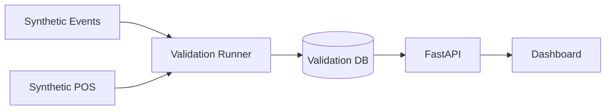

# Validation Flow

Deterministic synthetic dataset proving sessions, funnel, and revenue KPIs when **ENTRY events exist**.

Uses an **isolated database** — production `store_intelligence.db` is never modified.



## Step details

| Step | What happens | Location |
|------|--------------|----------|
| **Synthetic Events** | ENTRY-based demo event file | `data/synthetic/demo_events.jsonl` |
| **Synthetic POS** | Two matching POS transactions | `data/synthetic/demo_pos.csv` |
| **Validation Runner** | Ingest, compute analytics, write report | `scripts/demo_validation_run.py` |
| **Validation DB** | Isolated SQLite database | `data/databases/demo_validation.db` |
| **FastAPI** | Serves computed KPIs | Port 8000 |
| **Dashboard** | Display with metric date 2026-06-01 | Streamlit port 8501 |

## Expected results

| Metric | Value |
|--------|-------|
| Unique visitors | 3 |
| Sessions | 3 |
| Converted | 2 |
| Revenue (INR) | 2,148.50 |
| Conversion rate | 66.7% |

## Run commands

```powershell
python scripts/demo_validation_run.py

$env:DATABASE_URL = "sqlite:///./data/databases/demo_validation.db"
uvicorn app.main:app --host 0.0.0.0 --port 8000

$env:API_BASE_URL = "http://localhost:8000"
$env:DEFAULT_METRIC_DATE = "2026-06-01"
streamlit run dashboard/streamlit_app.py
```

Report: [../reports/demo_validation_report.md](../reports/demo_validation_report.md)

## Related

- [pipeline_flow.md](pipeline_flow.md)
- [system_architecture.md](system_architecture.md)
