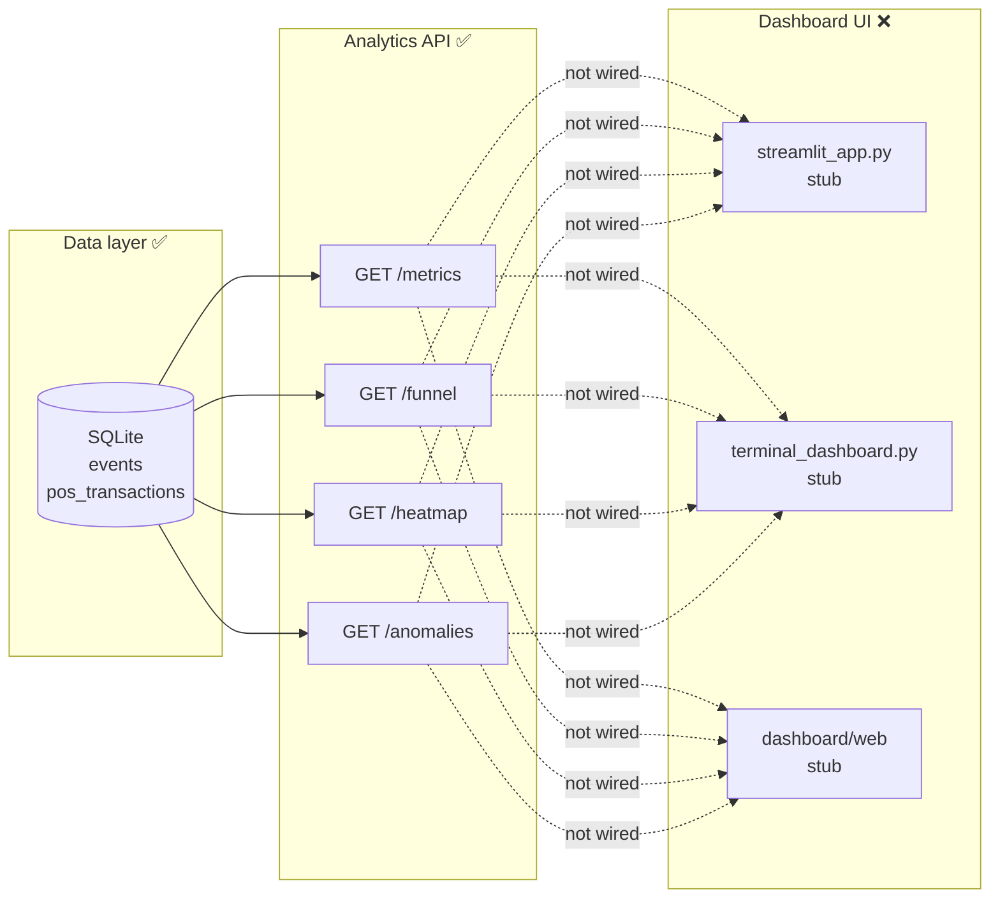

# Dashboard Readiness Report

**Date:** 2026-05-30  
**Scope:** `dashboard/streamlit_app.py`, `dashboard/terminal_dashboard.py`, analytics API routes  
**Audit only — no code changes**

---

## 1. Executive summary

| Question | Answer |
|----------|--------|
| Is there a working Streamlit dashboard? | **No** — file exists but is a one-line docstring stub |
| Does the dashboard read from SQLite? | **No** — no UI code; no DB or API client |
| Does it display metrics / funnel / heatmap / anomalies? | **No** |
| Real data or placeholders? | **Neither** — nothing is rendered |

**What works today:** The **FastAPI analytics layer** reads SQLite and exposes all four analytics surfaces via REST. That is the only “dashboard-adjacent” interface currently usable (Swagger UI at `/docs`, or `curl`).

**Demo gap:** Data is in SQLite (66 events, 24 POS via bridge), but sessions = 0, so all analytics return zeros. Even a built Streamlit UI would show empty charts until CAM3 ENTRY events are ingested.

---

## 2. Component inventory

### 2.1 `dashboard/streamlit_app.py`

| Attribute | Status |
|-----------|--------|
| Lines of code | **1** (module docstring only) |
| `import streamlit` | **Absent** |
| API client (`httpx`, `requests`) | **Absent** |
| SQLite access | **Absent** |
| UI widgets / charts | **Absent** |

Planned role (from `DESIGN.md`, `docker-compose.yml`): Streamlit app calling `GET /stores/{store_id}/metrics|funnel|heatmap|anomalies` using `API_BASE_URL`.

### 2.2 `dashboard/terminal_dashboard.py`

| Attribute | Status |
|-----------|--------|
| Lines of code | **1** (module docstring only) |
| `rich` library | **Not in `requirements.txt`** |
| Executable entry point | **None** |
| Implementation | **Stub** |

Docstring references “rich” as an alternative to Streamlit; no code was written.

### 2.3 `dashboard/web/`

| Attribute | Status |
|-----------|--------|
| Purpose | Optional React/Vite frontend (per `__init__.py`) |
| Implementation | **Empty package stub** |

### 2.4 Analytics API routes (not a dashboard, but the data source)

All routes are **fully implemented**, registered in `app/main.py`, and **read from SQLite** via SQLAlchemy:

| Endpoint | Module | SQLite tables | Computes |
|----------|--------|---------------|----------|
| `GET /stores/{store_id}/metrics?date=YYYY-MM-DD` | `app/metrics.py` | `events`, `pos_transactions` | unique visitors, conversion, dwell, queue, billing reach |
| `GET /stores/{store_id}/funnel?date=YYYY-MM-DD` | `app/funnel.py` | same | 4-stage funnel + drop-off |
| `GET /stores/{store_id}/heatmap?date=YYYY-MM-DD` | `app/heatmap.py` | `events` | zone engagement scores 0–100 |
| `GET /stores/{store_id}/anomalies?date=YYYY-MM-DD` | `app/anomalies.py` | both | queue spike, conversion drop, dead zone |

Supporting routes (ingest / health):

| Endpoint | Purpose |
|----------|---------|
| `POST /events/ingest` | Load events into SQLite |
| `POST /pos/ingest` | Load POS rows into SQLite |
| `GET /health` | Service + DB + per-store feed status |

**No dashboard-specific routes exist.** The UI was intended to consume the store analytics GET endpoints above.

---

## 3. Architecture (current vs intended)



**Intended path (Docker):** Streamlit container → `API_BASE_URL=http://api:8000` → FastAPI → SQLite.

**Actual path:** Operators use `/docs`, `curl`, or `scripts/bridge_pipeline_to_product.py` (which calls compute functions directly).

---

## 4. How to launch (exact commands)

### 4.1 Analytics API (required for any future dashboard)

**Local (PowerShell):**

```powershell
cd E:\Purpple_Vision
.\.venv\Scripts\Activate.ps1
uvicorn app.main:app --reload --host 0.0.0.0 --port 8000
```

- API docs: http://localhost:8000/docs  
- Health: http://localhost:8000/health  

**Docker (API only):**

```powershell
cd E:\Purpple_Vision
docker compose up --build
```

### 4.2 Streamlit dashboard (stub — launches blank page)

**Local:**

```powershell
cd E:\Purpple_Vision
.\.venv\Scripts\Activate.ps1
# Terminal 1: start API first
uvicorn app.main:app --host 0.0.0.0 --port 8000
# Terminal 2:
$env:API_BASE_URL = "http://localhost:8000"
streamlit run dashboard/streamlit_app.py --server.port 8501
```

- URL: http://localhost:8501  
- **Expected behavior today:** Streamlit starts successfully but renders **no widgets, metrics, or charts** (empty page).

**Docker (API + Streamlit profile):**

```powershell
cd E:\Purpple_Vision
docker compose --profile dashboard up --build
```

- API: http://localhost:8000  
- Streamlit: http://localhost:8501 (still blank until UI is implemented)

### 4.3 Terminal dashboard

**Not launchable.** No `if __name__ == "__main__"` block, no CLI, `rich` not listed in `requirements.txt`.

### 4.4 View analytics without a dashboard (works today)

After bridge ingest, query with the bridged metric date:

```powershell
curl "http://localhost:8000/stores/STORE_BLR_002/metrics?date=2026-04-10"
curl "http://localhost:8000/stores/STORE_BLR_002/funnel?date=2026-04-10"
curl "http://localhost:8000/stores/STORE_BLR_002/heatmap?date=2026-04-10"
curl "http://localhost:8000/stores/STORE_BLR_002/anomalies?date=2026-04-10"
```

Current bridged data returns valid JSON with **zeros** (0 sessions — see `final_session_gap_report.md`).

---

## 5. Missing components

| Component | Priority | Notes |
|-----------|----------|-------|
| Streamlit UI implementation | **P0** | Pages, layout, `st.metric` / charts, error states |
| HTTP client to API | **P0** | `httpx` already in deps; read `API_BASE_URL` env |
| Store + date selectors | **P0** | Default `STORE_BLR_002`, date matching ingested data |
| Metrics panel | **P0** | Bind to `GET .../metrics` |
| Funnel visualization | **P0** | Bar chart or step funnel from `GET .../funnel` |
| Heatmap visualization | **P1** | Table or chart from `GET .../heatmap`; show `data_confidence` |
| Anomalies panel | **P1** | Alert cards from `GET .../anomalies` |
| Auto-refresh / polling | **P2** | Optional live mode |
| Terminal dashboard (`rich`) | **P3** | Alternative UI; add `rich` to requirements if pursued |
| React/Vite frontend (`dashboard/web`) | **P3** | Optional; not started |
| Purchase matches in UI | **P3** | No API route exists for `purchase_matches.json` |
| Session-producing pipeline data | **P0 for meaningful demo** | CAM3 ENTRY events required before non-zero analytics |

---

## 6. Data readiness vs UI readiness

From `bridge_validation_report.md` (post-bridge state):

| Layer | Status | Detail |
|-------|--------|--------|
| SQLite populated | ✅ | 66 events, 24 POS for `2026-04-10` |
| API computes analytics | ✅ | All four endpoints return HTTP 200 |
| Sessions | ❌ | 0 — zone-only events, no ENTRY |
| Metrics / funnel values | ⚠️ | All zeros (expected given 0 sessions) |
| Heatmap zones | ⚠️ | 0 zones reported |
| Anomalies | ⚠️ | 0 alerts |
| Streamlit display | ❌ | No UI to show even zero-state data |

A dashboard implementation would **work mechanically** (API returns JSON) but would **look empty** until pipeline produces ENTRY events and optionally CAM5 billing events.

---

## 7. Demo readiness score

Scoring: 0 = not started, 10 = production-ready for demo.

| Area | Score | Rationale |
|------|-------|-----------|
| Analytics API (SQLite → JSON) | **9 / 10** | Complete, tested, documented; only missing purchase-match endpoint |
| Data ingest / bridge | **7 / 10** | Bridge works; idempotent; session gap limits usefulness |
| Streamlit dashboard | **1 / 10** | Dependency + Docker profile exist; zero UI logic |
| Terminal dashboard | **0 / 10** | Docstring only; not in deps |
| End-to-end visual demo | **2 / 10** | API + Swagger usable; no charts; analytics all zero |
| Docker orchestration | **6 / 10** | API profile solid; dashboard profile runs empty Streamlit |

### Overall demo readiness: **25 / 100**

**Breakdown:**

- **Backend intelligence layer:** Demo-ready via API/Swagger (`/docs`).
- **Visual dashboard:** Not demo-ready — stubs only.
- **Compelling metrics demo:** Blocked by (1) missing Streamlit UI and (2) zero sessions in current dataset.

### Minimum path to a credible dashboard demo

1. Implement `dashboard/streamlit_app.py` (API client + 4 panels).
2. Run CAM3 pipeline → re-bridge → at least one ENTRY session.
3. Optionally run CAM5 for funnel billing stage and anomalies.
4. Launch API + Streamlit with `date=2026-04-10` and `STORE_BLR_002`.

---

## 8. Summary

There is **no working Streamlit or terminal dashboard**. Analytics **routes** are complete and read SQLite correctly, but nothing in `dashboard/` consumes them. Docker can start Streamlit on port 8501, but the page is blank. For a demo today, use **FastAPI at http://localhost:8000/docs** or curl against the four `GET /stores/{id}/...` endpoints. Building the Streamlit UI and fixing the session data gap (CAM3 ENTRY events) are the two blockers for a visual, non-zero dashboard demo.
