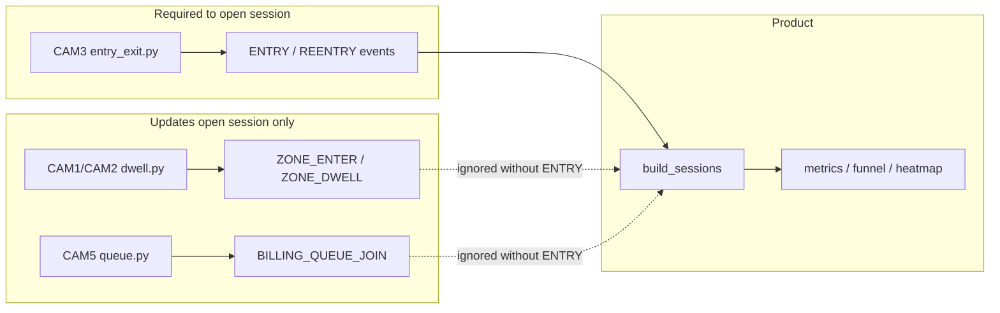

# Final Session Gap Report

**Date:** 2026-05-30  
**Context:** 66 events + 24 POS rows ingested via `bridge_pipeline_to_product.py`; `build_sessions()` returns **0 sessions**  
**Audit only — no code changes**

---

## 1. How `build_sessions()` works

Source: `app/sessions.py`

```python
_SESSION_OPENERS = frozenset({EventType.ENTRY, EventType.REENTRY})
```

Processing loop (simplified):

1. Sort all events by `timestamp`.
2. **If `event_type` is ENTRY or REENTRY** → open a new `VisitorSession` for that `visitor_id`.
3. **Else** → look up open session for `visitor_id`.
4. **If no open session** → **discard event** (orphan).
5. If open session exists → update session fields; **EXIT** closes the session.

There is no fallback that creates a session from `ZONE_ENTER` alone.

---

## 2. Event type reference table

Purpple `EventType` values after pipeline adaptation (`pipeline/event_adapter.py`):

| Event type (DB / API) | NOTEBK / pipeline source | Used by | Mandatory for sessions? |
|----------------------|--------------------------|---------|-------------------------|
| **ENTRY** | CAM3 `entry_exit.py` → `"ENTRY"` | `build_sessions` — **opens session** | **Yes** (or REENTRY) |
| **REENTRY** | CAM3 (future) → `"REENTRY"` | `build_sessions` — **opens session** | **Yes** (alternative opener) |
| **EXIT** | CAM3 → `"EXIT"` | `build_sessions` — **closes session** | No for creation; **Yes** for complete visit lifecycle |
| **ZONE_ENTER** | CAM1/CAM2 `dwell.py`; CAM5 `PAYMENT_ENTER` → mapped to ZONE_ENTER + BILLING | `_apply_session_event` → `zones_visited`, billing if zone=BILLING | **No** — ignored without open session |
| **ZONE_EXIT** | CAM1/CAM2; CAM5 `PAYMENT_EXIT` | *(no session field updates)* | **No** |
| **ZONE_DWELL** | CAM1/CAM2 `DWELL_COMPLETED` → adapted | `_apply_session_event` → dwell + zones_visited | **No** — ignored without open session |
| **BILLING_QUEUE_JOIN** | CAM5 `QUEUE_ENTER` → adapted | `_apply_session_event` → `joined_queue`, `reached_billing` | **No** — ignored without open session |
| **BILLING_QUEUE_ABANDON** | CAM5 `QUEUE_EXIT` → adapted | `_apply_session_event` → `abandoned_queue` | **No** — ignored without open session |

### Downstream analytics dependencies (after session exists)

| Session field | Set by event types | Used by |
|---------------|-------------------|---------|
| *(session exists)* | ENTRY / REENTRY | `count_unique_visitors`, funnel stage 1 |
| `zones_visited` | ZONE_ENTER, ZONE_DWELL (+ billing events with zone_id) | Funnel `reached_any_zone`, heatmap |
| `joined_queue` | BILLING_QUEUE_JOIN | Funnel `billing_queue` |
| `reached_billing` / `billing_activity_at` | BILLING zone ZONE_ENTER, ZONE_DWELL, queue join/abandon | `pos_correlation`, conversion rate |
| `ended_at` / closed session | EXIT | Session completeness |

---

## 3. Ingested dataset composition

From `data/generated/pipeline_demo/` (Purpple JSONL ingested by bridge):

| File | Events | Types present |
|------|--------|---------------|
| `cam1_events.jsonl` | 24 | ZONE_ENTER (8), ZONE_EXIT (8), ZONE_DWELL (8) |
| `cam2_events.jsonl` | 42 | ZONE_ENTER (14), ZONE_EXIT (14), ZONE_DWELL (14) |
| `cam3_events.jsonl` | **0** | *(empty file)* |
| `cam5_events.jsonl` | **0** | *(empty file)* |
| **Total ingested** | **66** | **No ENTRY, EXIT, REENTRY, or billing events** |

POS: 24 transactions ingested — available for conversion **after** sessions with `billing_activity_at` exist.

---

## 4. Why 66 events → 0 sessions

Step-by-step trace:

1. Bridge successfully ingested all 66 events into SQLite — ingestion is **not** the problem.
2. `build_sessions()` processes each event in time order.
3. Every event is `ZONE_ENTER`, `ZONE_EXIT`, or `ZONE_DWELL`.
4. None match `_SESSION_OPENERS` (ENTRY / REENTRY).
5. For each event, `open_by_visitor.get(visitor_id)` is `None`.
6. Code path at lines 76–79: **orphan events are skipped**.
7. Result: `sessions = []`, `count_unique_visitors = 0`.

The 66 events are valid and correctly stored; they are **structurally unusable** for session creation under current product rules.

---

## 5. Root cause verdict

| Hypothesis | Verdict |
|------------|---------|
| **A) Dataset genuinely lacks required events** | **Yes** — zero ENTRY/REENTRY in bridged JSONL |
| **B) Pipeline not generating expected types** | **Yes** — for the **current demo run** |

**Combined answer:** **B drives A.** The product requires ENTRY to open sessions. The bridged dataset contains only shelf-zone events because:

1. **CAM3 and CAM5 demo outputs are empty** — no ENTRY/EXIT or queue/payment events were produced or saved.
2. **CAM1/CAM2 pipelines never emit ENTRY by design** — `pipeline/dwell.py` only emits ZONE_ENTER / ZONE_EXIT / DWELL_COMPLETED.
3. **`run_pipeline_demo.py` includes CAM3/CAM5** in its orchestration list, but empty JSONL files indicate those pipelines did not populate output (not run, failed, or zero events in preview window).

This is **not** a bug in `build_sessions()`, bridge ingest, or SQLite. It is a **missing camera coverage gap** in the generated demo dataset relative to session semantics.

---

## 6. Architecture: session gate vs pipeline outputs



---

## 7. Minimum changes to make sessions appear

**No product code changes required.** Pipeline + orchestration changes only:

### Required (sessions > 0)

| # | Change | Expected outcome |
|---|--------|------------------|
| 1 | **Run CAM3 pipeline to completion** (`process_cam3_video` via `run_pipeline_demo.py` or direct CLI) | `cam3_events.jsonl` contains `ENTRY` / `EXIT` (NOTEBK) → Purpple `ENTRY` / `EXIT` |
| 2 | **Re-run bridge** (`python scripts/bridge_pipeline_to_product.py`) | ENTRY events open sessions; zone events from CAM1/CAM2 attach to same `visitor_id` tracks if IDs align |
| 3 | **Verify track ID continuity** | CAM3 ByteTrack IDs must map to `VIS_*` via adapter; shelf cameras use separate track IDs — **cross-camera session linking is not implemented**; each camera track is a separate `visitor_id` unless ReID merges them |

**Minimum viable session count:** At least **1 ENTRY** event ingested → at least **1 session** (even if zone/funnel fields stay empty for that visitor).

### Recommended (meaningful funnel + conversion)

| # | Change | Expected outcome |
|---|--------|------------------|
| 4 | **Run CAM5 pipeline to completion** | `QUEUE_ENTER` → `BILLING_QUEUE_JOIN`; populates funnel `billing_queue` |
| 5 | **Ensure CAM5 `PAYMENT_ENTER` or BILLING zone events** | Sets `reached_billing` / `billing_activity_at` for `pos_correlation` |
| 6 | **Process sufficient clip length** | Current CAM1/CAM2 outputs cover ~2–3 minutes; may need full clips for overlap with POS times |
| 7 | **Re-bridge + validate** | `bridge_validation_report.md` should show `sessions > 0`, `unique_visitors > 0` |

### Not required for basic sessions

- Changing `build_sessions()` to open on ZONE_ENTER *(would be a product semantics change — out of scope)*.
- Purchase matching (`purchase_matches.json`) — offline only; does not affect sessions.
- HTTP ingest — bridge already uses same internal path.

---

## 8. Expected state after minimum fixes

Assuming CAM3 produces N entry detections and bridge re-ingests:

| Metric | Current | After CAM3 + re-bridge |
|--------|---------|------------------------|
| Events ingested | 66 | 66 + CAM3 events |
| Sessions | 0 | **≥ number of distinct ENTRY visitor_ids** |
| unique_visitors | 0 | **≥ 1** |
| reached_any_zone | 0 | Still **0** unless ENTRY visitor_ids match CAM1/CAM2 `VIS_*` tracks |
| conversion_rate | 0 | Still **0** until billing events + POS window align |

**Important limitation:** Sessions are **per visitor_id**, not cross-camera fused. CAM3 track `VIS_5` entering the store is a different session from CAM1 track `VIS_5` on the shelf unless IDs are intentionally unified. Zone events from CAM1/CAM2 only enrich sessions for the **same** `visitor_id` that already has an open ENTRY session.

---

## 9. Checklist

- [x] Ingestion path works (66 events, 24 POS in SQLite)
- [x] Analytics functions execute without error
- [ ] CAM3 generates ENTRY/EXIT JSONL *(empty today)*
- [ ] CAM5 generates queue/payment JSONL *(empty today)*
- [ ] At least one ENTRY ingested before bridge session check
- [ ] Re-bridge after full demo run

---

## 10. Summary

**Zero sessions is expected behavior** given the ingested event mix. `build_sessions()` mandates **ENTRY or REENTRY** as the sole session openers. The bridged dataset contains **only shelf zone events** from CAM1/CAM2; **CAM3/CAM5 outputs are empty**. Fix by running the full multi-camera demo (at minimum CAM3), then re-running the bridge — not by changing session business logic.
