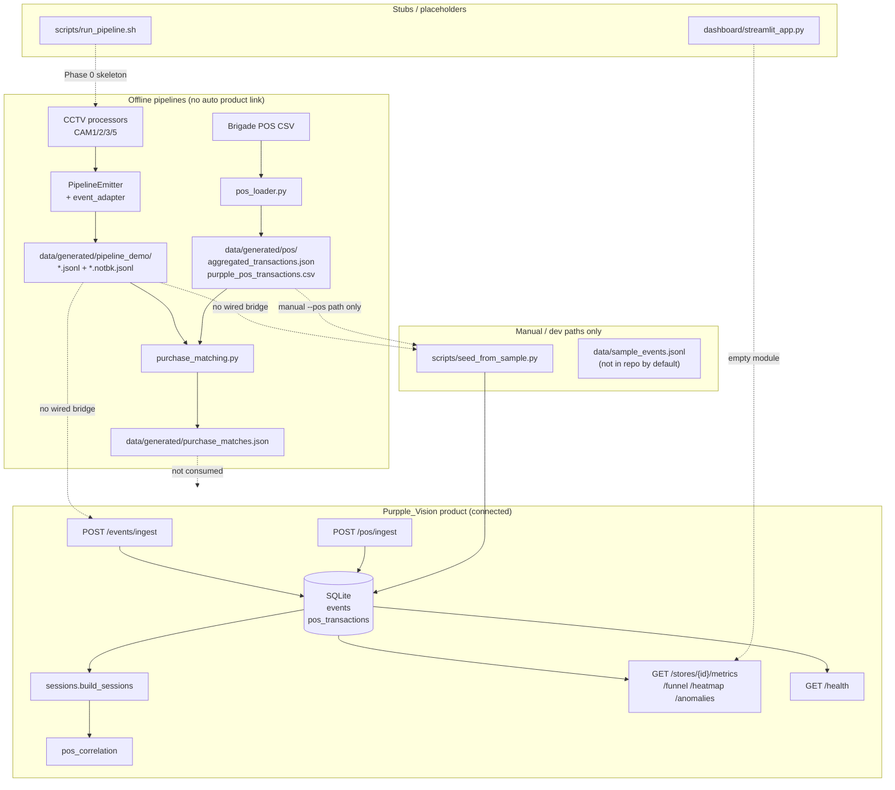
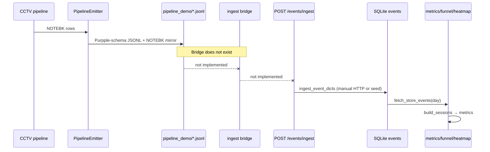
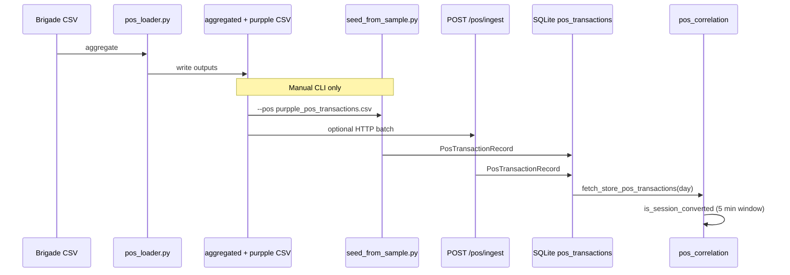
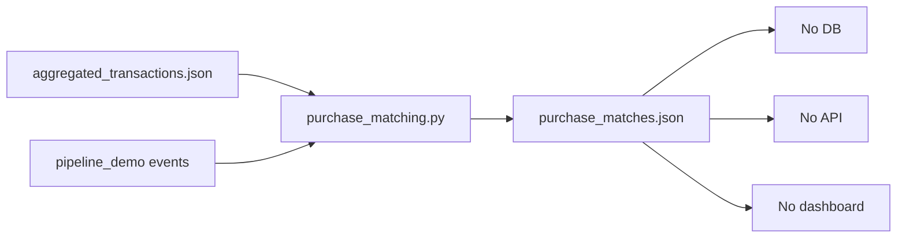

# Phase 6 — End-to-End Product Integration Audit

**Date:** 2026-05-30  
**Scope:** CCTV pipeline, POS pipeline, purchase matching vs Purpple_Vision product (API, DB, dashboard)  
**Verdict:** Pipelines are **implemented and producing files** but are **not automatically connected** to the running product. Analytics APIs work when data is in SQLite via ingest/seed; generated pipeline outputs remain **standalone artifacts**.

---

## 1. Executive summary

| Layer | Status |
|-------|--------|
| CCTV pipeline (`pipeline/cam*.py`, `dwell`, `entry_exit`, `queue`) | Migrated — writes JSONL to `data/generated/pipeline_demo/` |
| POS pipeline (`pipeline/pos_loader.py`) | Migrated — writes JSON/CSV to `data/generated/pos/` |
| Purchase matching (`pipeline/purchase_matching.py`) | Migrated — writes `data/generated/purchase_matches.json` |
| **Bridge pipeline → SQLite** | **Missing** — no script calls `ingest_event_dicts` / `ingest_pos_transaction_dicts` |
| **Intelligence API** | **Connected** — reads only from SQLite (`events`, `pos_transactions`) |
| **Dashboard** | **Stub only** — no UI reads API or pipeline files |
| **Purchase matches in product** | **Not connected** — no DB table, route, or analytics consumer |

---

## 2. Architecture diagram (as deployed today)

---

## 3. Data flow diagrams

### 3.1 Events path

**What works if you manually ingest Purpple JSONL:**

- `data/generated/pipeline_demo/cam1_events.jsonl` rows validate against `app.models.Event`
- `ingest_event_dicts()` in `app/ingestion.py` persists to `EventRecord`

**What breaks for current demo output:**

- Demo JSONL has **no ENTRY/EXIT** events (zone-only CAM1/CAM2 clips)
- `build_sessions()` opens sessions only on `ENTRY` / `REENTRY` → **0 sessions** → unique visitors = 0, funnel empty
- No CAM3/CAM5 demo files → no billing queue / conversion path from pipeline data alone

### 3.2 POS transactions path

**Connected in product:** `app/pos_correlation.py` → `app/metrics.py`, `app/funnel.py`, `app/anomalies.py`

**Not connected automatically:** `pos_loader` output → DB (requires explicit seed/ingest command)

### 3.3 Purchase matches path

**Fully standalone.** Product analytics never read `purchase_matches.json`.

---

## 4. API routes inventory

| Method | Path | Module | Data source | Pipeline connected? |
|--------|------|--------|-------------|---------------------|
| GET | `/health` | `app/health.py` | DB ingest lag | Only if events ingested |
| POST | `/events/ingest` | `app/ingestion.py` | Request body → `events` | **No auto-feed from pipeline** |
| POST | `/pos/ingest` | `app/pos_ingestion.py` | Request body → `pos_transactions` | **No auto-feed from pos_loader** |
| GET | `/stores/{id}/metrics` | `app/metrics.py` | DB events + POS | Indirect (after manual ingest) |
| GET | `/stores/{id}/funnel` | `app/funnel.py` | DB events + POS + `pos_correlation` | Indirect |
| GET | `/stores/{id}/heatmap` | `app/heatmap.py` | DB events → sessions | Indirect |
| GET | `/stores/{id}/anomalies` | `app/anomalies.py` | DB events + POS | Indirect |
| — | *(none)* | — | `purchase_matches.json` | **Not exposed** |

---

## 5. What is already connected

### 5.1 Inside the product (fully wired)

| Component | Connection |
|-----------|------------|
| `app/models.Event` | Ingest validation schema; matches `PipelineEmitter` output shape |
| `pipeline/event_adapter.py` | Maps NOTEBK pipeline rows → `Event` (used at emit time, not at ingest API) |
| `app/db.EventRecord` / `PosTransactionRecord` | ORM tables for both ingest routes |
| `app/sessions.build_sessions` | All analytics derive sessions from ingested events |
| `app/pos_correlation` | Conversion rule for metrics/funnel/anomalies |
| `app/metrics` / `funnel` / `heatmap` / `anomalies` | All query DB by `store_id` + UTC day |
| `scripts/seed_from_sample.py` | Idempotent loader for challenge-format JSONL + CSV |
| Tests (`test_ingestion`, `test_pos_ingestion`, `test_metrics`, …) | API + DB path covered with synthetic data |

### 5.2 Pipeline → schema (partial — file level only)

| Output | Purpple-compatible? | Auto-loaded to DB? |
|--------|---------------------|------------------|
| `pipeline_demo/cam*_events.jsonl` | Yes — valid `Event` JSON | **No** |
| `pipeline_demo/cam*_events.notbk.jsonl` | NOTEBK shape (for purchase_matching only) | **No** |
| `pos/purpple_pos_transactions.csv` | Yes — `PosTransaction` CSV | **No** (manual seed) |
| `pos/aggregated_transactions.json` | NOTEBK analytics shape | **No** |
| `purchase_matches.json` | Offline analytics only | **No** |

---

## 6. What is still standalone / disconnected

| Item | Location | Issue |
|------|----------|-------|
| Pipeline demo outputs | `data/generated/pipeline_demo/` | Never passed to `/events/ingest` or seed |
| Brigade POS outputs | `data/generated/pos/` | Not called from `run_pipeline_demo.py` |
| Purchase matches | `data/generated/purchase_matches.json` | No product consumer |
| `scripts/run_pipeline_demo.py` | Orchestrates cameras only | No POS step, no DB ingest step, no purchase matching step |
| `scripts/run_pipeline.sh` | Skeleton comment only | "Phase 0 — no implementation" |
| `dashboard/streamlit_app.py` | One-line stub | No API client |
| `dashboard/terminal_dashboard.py` | One-line stub | No API client |
| `data/sample_events.jsonl` | Documented default seed path | **Not present** in repo (tests build temp files) |
| CAM3/CAM5 in demo output | Missing files | Entry/billing funnel cannot be exercised from generated data |
| ENTRY events in demo JSONL | Absent | Sessions engine produces empty session list |

---

## 7. Placeholders, mock data, and stubs

| Artifact | Type | Notes |
|----------|------|-------|
| `dashboard/streamlit_app.py` | **Stub** | Docstring only |
| `dashboard/terminal_dashboard.py` | **Stub** | Docstring only |
| `scripts/run_pipeline.sh` | **Stub** | No pipeline + ingest orchestration |
| `data/sample_events.jsonl` | **Missing file** | README/seed defaults; evaluators must supply or use generated JSONL manually |
| `pipeline/staff.py` | **Stub** | CAM4 not in product |
| Unit/integration tests | **Synthetic** | Inline event/POS fixtures; not reading `data/generated/` |
| `DESIGN.md` pipeline section | **Stale** | Still describes pipeline as "scaffolded/not built" |
| `PROJECT_STATE.md` | **Partially stale** | Lists `pos_loader.py` under stubs |

---

## 8. Purchase matching vs `app/pos_correlation.py`

| Dimension | `pipeline/purchase_matching.py` | `app/pos_correlation.py` |
|-----------|--------------------------------|--------------------------|
| Trigger | Offline CLI | Runtime API query |
| Input | JSON files on disk | SQLite `EventRecord` + `PosTransactionRecord` |
| Unit | POS invoice | Visitor session |
| Time window | ±5 min around txn | 5 min **before** txn only |
| Output | `purchase_matches.json` + confidence + journey | Boolean conversion → funnel/metrics |
| In dashboard/API | **No** | **Yes** (via metrics/funnel) |

Both can coexist; today only `pos_correlation` affects the product.

---

## 9. Generated artifacts vs product (current repo state)

| File | Exists | Used by product |
|------|--------|-----------------|
| `data/generated/pipeline_demo/cam1_events.jsonl` | Yes (24 events) | No |
| `data/generated/pipeline_demo/cam2_events.jsonl` | Yes (42 events) | No |
| `data/generated/pipeline_demo/cam3_events.jsonl` | No | — |
| `data/generated/pipeline_demo/cam5_events.jsonl` | No | — |
| `data/generated/pos/aggregated_transactions.json` | Yes (24 invoices) | No |
| `data/generated/pos/purpple_pos_transactions.csv` | Yes (24 rows) | No (until seed) |
| `data/generated/purchase_matches.json` | Yes (24 records) | No |

---

## 10. Exact next implementation task

**Primary gap:** There is no **orchestrated bridge** from `data/generated/` into SQLite.

### Recommended single task (Phase 6 implementation)

**Create `scripts/bridge_pipeline_to_product.py`** (or extend `run_pipeline_demo.py`) that:

1. **Events:** Read all `data/generated/pipeline_demo/cam*_events.jsonl` (Purpple schema), batch through `app.ingestion.ingest_event_dicts()` (or direct `event_to_record` + session commit).
2. **POS:** Run `python -m pipeline.pos_loader` if outputs stale; then load `data/generated/pos/purpple_pos_transactions.csv` via existing `seed_from_sample.load_pos_csv()` or `ingest_pos_transaction_dicts()`.
3. **Validate:** Print counts from DB + call `GET /stores/STORE_BLR_002/metrics?date=2026-04-10` locally.
4. **Optional:** Chain `python -m pipeline.purchase_matching` for offline report (still not API-facing).

### Secondary tasks (ordered)

| # | Task | Unblocks |
|---|------|----------|
| 2 | Complete `run_pipeline_demo.py` for CAM3 + CAM5 + full clips | ENTRY, billing, conversion metrics |
| 3 | Ensure demo emits `ENTRY`/`EXIT` (CAM3) and `BILLING_QUEUE_JOIN` (CAM5) | `build_sessions`, funnel stages |
| 4 | Implement `run_pipeline.sh` to call demo → bridge → optional matching | One-command E2E |
| 5 | Build Streamlit dashboard calling existing GET endpoints | Visual product |
| 6 | *(Optional)* `GET /stores/{id}/purchase-matches` reading JSON or new DB table | Expose offline matching in API |

---

## 11. Conclusion

**Migrated pipelines are production-quality offline processors** with correct Purpple schema adaptation at emit time (events) and export time (POS). **The product API layer is complete** for ingest → DB → analytics. The missing link is **integration glue**: nothing automatically moves `data/generated/*` into SQLite, and **purchase matching is intentionally isolated** as an offline validation tool.

Until the bridge script exists and demo pipelines emit full-funnel event types (ENTRY, billing, CAM5), API metrics for Brigade store data will remain at **zero or seed-only** values even though `purchase_matches.json` generates successfully.

**Audit only — no code changes made in Phase 6.**
