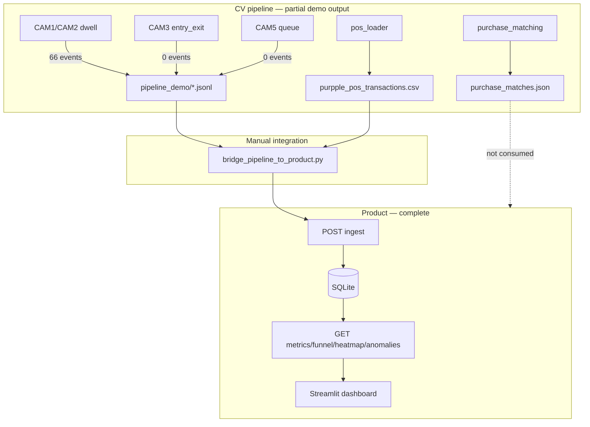

# Project Completion Report — Purpple_Vision

**Date:** 2026-05-31  
**Repository:** `e:\Purpple_Vision`  
**Challenge:** Apex Retail 48-Hour Engineering Hiring Challenge  
**Audit type:** Read-only codebase review (no code changes)

---

## 1. Executive summary

Purpple_Vision is a **strong Intelligence API product** with a **substantially migrated CV pipeline** and a **working Streamlit dashboard**, but **end-to-end demo value is limited** because CAM3/CAM5 produced zero events in the last run, yielding **0 sessions** and all-zero analytics despite 66 events and 24 POS rows in SQLite.

| Lens | Score |
|------|-------|
| **Overall completion** | **~76%** |
| **Demo readiness** | **~35 / 100** |
| **Submission readiness** | **~80 / 100** |

The largest remaining gaps are **operational** (CAM3 ENTRY detection, auto-ingest wiring, non-zero session demo) and **documentation drift** (README/PROJECT_STATE still describe pipeline and dashboard as stubs).

---

## 2. Component status matrix

### 2.1 Fully implemented

| Component | Location | Evidence |
|-----------|----------|----------|
| Event schema & validation | `app/models.py` | Pydantic v2, 8 event types, zone rules, UUID v4 |
| Event batch ingest | `app/ingestion.py` | `POST /events/ingest`, idempotent, partial success |
| POS batch ingest | `app/pos_ingestion.py` | `POST /pos/ingest`, idempotent |
| SQLite persistence | `app/db.py` | `events`, `pos_transactions`, WAL mode |
| Session engine | `app/sessions.py` | ENTRY/REENTRY open, EXIT close, zone enrichment |
| POS correlation | `app/pos_correlation.py` | 5-minute billing window |
| Store metrics API | `app/metrics.py` | North Star conversion, dwell, queue, billing reach |
| Funnel API | `app/funnel.py` | 4 stages + drop-off % |
| Heatmap API | `app/heatmap.py` | Normalized 0–100 engagement scores |
| Anomalies API | `app/anomalies.py` | Queue spike, conversion drop, dead zone |
| Health API | `app/health.py` | DB status, per-store feeds, STALE_FEED |
| Structured logging | `app/logging_config.py` | Request middleware, trace IDs |
| FastAPI app shell | `app/main.py` | Lifespan, routers, 503 handlers |
| Docker deployment | `Dockerfile`, `docker-compose.yml` | API + optional dashboard profile |
| App test suite | `tests/test_*.py` | **125 tests**, ~95% `app/` coverage |
| YOLO detection | `pipeline/detect.py` | YOLO11m person detection |
| ByteTrack tracking | `pipeline/tracker.py` | Multi-object tracking |
| Zone polygons | `pipeline/zones.py` | Overlap-based zone assignment |
| CAM1/CAM2 dwell pipeline | `pipeline/dwell.py`, `cam1/2_processor.py` | 66 demo events produced |
| CAM3 entry/exit code | `pipeline/entry_exit.py` | Line-crossing + REENTRY logic |
| CAM5 queue/billing code | `pipeline/queue.py` | Queue join/exit, payment zones |
| Event emission | `pipeline/emit.py`, `event_adapter.py` | NOTEBK → Purpple JSONL |
| Brigade POS loader | `pipeline/pos_loader.py` | 24 invoices aggregated |
| Offline purchase matching | `pipeline/purchase_matching.py` | JSON output (0 matches in practice) |
| Pipeline demo orchestrator | `scripts/run_pipeline_demo.py` | CAM1/2/3/5 runner + report |
| Pipeline → SQLite bridge | `scripts/bridge_pipeline_to_product.py` | Uses same ingest as HTTP |
| Seed script | `scripts/seed_from_sample.py` | Challenge-format loader |
| Streamlit dashboard | `dashboard/streamlit_app.py` | KPIs, funnel, heatmap, anomalies, empty state |
| Example API payloads | `examples/*.json` | 5 endpoint examples |

### 2.2 Partially implemented

| Component | Status | Gap |
|-----------|--------|-----|
| **Multi-camera CV pipeline** | CAM1/CAM2 emit events; CAM3/CAM5 code exists | Demo outputs **empty** (0 ENTRY, 0 queue events) |
| **End-to-end product flow** | Bridge script works manually | Not wired into `run_pipeline_demo.py` or HTTP auto-ingest |
| **Purchase matching** | Algorithm ported | 0 matches (CCTV evening vs POS daytime; no CAM5 events) |
| **Anomaly detection** | 3 detectors live | Fixed thresholds; no 7-day rolling baseline or 30-min dead-zone timer per PDF wording |
| **Streamlit Revenue KPI** | Card present | API has no daily revenue total → shows **—** |
| **REENTRY events** | Logic in `entry_exit.py` | Not observed in generated demo files |
| **Documentation** | DESIGN/CHOICES rich | README, PROJECT_STATE, DESIGN §3.4 **outdated** (stubs) |
| **Test coverage** | App thoroughly tested | **No** `test_pipeline.py`; pipeline untested in CI |
| **POS → conversion demo** | 24 rows in SQLite | 0 converted visitors (no billing sessions) |

### 2.3 Stubs / placeholders

| File / area | Notes |
|-------------|-------|
| `pipeline/staff.py` | Docstring only — no staff vs customer classification |
| `dashboard/terminal_dashboard.py` | Docstring only; `rich` not in requirements |
| `dashboard/web/` | Empty React/Vite placeholder package |
| `scripts/run_pipeline.sh` | Bash skeleton — "Phase 0 skeleton" |
| `tests/assertions.py` | Docstring only — challenge ground-truth assertions missing |
| `pipeline/sink.py` | Protocol stub only (used via `PipelineEmitter`) |

**Note:** Older docs (`README.md`, `PROJECT_STATE.md`, `DESIGN.md` §3.1/§3.4) still label `pipeline/` and `streamlit_app.py` as stubs. That is **no longer accurate** for most pipeline modules and the Streamlit app.

---

## 3. Feature checklist (original problem statement)

Mapped to Apex Retail challenge parts (PDF structure referenced in `PROJECT_STATE.md`, `PHASE_6B_REPORT.md`).

### Part A — Detection pipeline (~30 pts)

| Feature | Status |
|---------|--------|
| Person detection (YOLO) | ✅ Implemented (`detect.py`, YOLO11m) |
| Multi-object tracking (ByteTrack) | ✅ Implemented |
| Zone mapping from polygons | ✅ Implemented |
| ZONE_ENTER / ZONE_EXIT / ZONE_DWELL | ✅ CAM1/CAM2 producing events |
| ENTRY / EXIT / REENTRY | ⚠️ Code complete; **0 events in demo output** |
| BILLING_QUEUE_JOIN / ABANDON | ⚠️ Code complete; **0 events in demo output** |
| Staff vs customer classification | ❌ Stub (`staff.py`) |
| CAM4 processor | ❌ Not present |
| Cross-camera visitor deduplication | ❌ Not implemented |
| Group entry splitting | ❌ Not implemented |
| Schema-compliant JSONL emission | ✅ `emit.py` + `event_adapter.py` |
| Clip → ingest automated script | ⚠️ `run_pipeline_demo.py` + manual bridge; `run_pipeline.sh` stub |
| Pipeline unit/integration tests | ❌ Missing |
| Challenge ground-truth assertions (10) | ❌ `tests/assertions.py` empty |

### Part B — Intelligence API

| Feature | Status |
|---------|--------|
| `POST /events/ingest` | ✅ |
| `POST /pos/ingest` | ✅ |
| `GET /stores/{id}/metrics` | ✅ |
| `GET /stores/{id}/funnel` | ✅ |
| `GET /stores/{id}/heatmap` | ✅ |
| `GET /stores/{id}/anomalies` | ✅ |
| `GET /health` | ✅ |
| Session engine (ENTRY → EXIT) | ✅ |
| POS correlation (5-min window) | ✅ |
| North Star conversion rate | ✅ |
| Optional `?date=YYYY-MM-DD` | ✅ |
| Daily revenue summary endpoint | ❌ Not exposed |
| Purchase-match API / DB table | ❌ Offline JSON only |

### Part C — Production readiness

| Feature | Status |
|---------|--------|
| Docker `compose up` (no .env required) | ✅ |
| SQLite persistence + bind mount | ✅ |
| Structured logging + request trace | ✅ |
| Global error handlers (503 on DB failure) | ✅ |
| Idempotent ingest | ✅ |
| pytest suite (125 tests) | ✅ |
| STALE_FEED health warnings | ✅ |
| Alembic / migrations | ❌ Not used (by design) |
| Pipeline CI tests | ❌ |

### Part D — Documentation

| Feature | Status |
|---------|--------|
| README setup & API docs | ⚠️ Partial — pipeline/dashboard status **stale** |
| DESIGN.md architecture | ⚠️ Partial — §3.1/§3.4 outdated |
| CHOICES.md technical decisions | ✅ |
| Example JSON payloads | ✅ |
| Phase / audit reports | ✅ Extensive (10+ markdown reports) |
| PROMPT blocks in tests | ✅ Present in test files |

### Part E — Live dashboard (bonus)

| Feature | Status |
|---------|--------|
| Streamlit UI | ✅ Phase 8 complete |
| Store + date selectors | ✅ |
| KPI cards | ✅ (Revenue shows —; no API field) |
| Funnel visualization | ✅ (hidden when sessions = 0) |
| Heatmap visualization | ✅ (hidden when sessions = 0) |
| Anomaly panels | ✅ (hidden when sessions = 0) |
| Empty-state UX (sessions = 0) | ✅ |
| Terminal dashboard (`rich`) | ❌ Stub |
| React/Vite frontend | ❌ Stub |

### Acceptance gates (`PROJECT_STATE.md` §15)

| # | Gate | Status |
|---|------|--------|
| 1 | `docker compose up` starts API | ✅ |
| 2 | README explains detection pipeline | ⚠️ **Outdated** — says "not implemented" |
| 3 | `POST /events/ingest` works | ✅ |
| 4 | `GET /stores/.../metrics` returns JSON | ✅ |
| 5 | DESIGN.md + CHOICES.md substantive | ✅ |

**Gate score: 4.5 / 5**

---

## 4. Current data state (bridged demo)

| Artifact | Count | Notes |
|----------|-------|-------|
| Events in SQLite | 66 | CAM1/CAM2 zone events only |
| POS transactions | 24 | Brigade aggregated |
| Sessions | **0** | No ENTRY/REENTRY events |
| Analytics (metrics/funnel/heatmap) | All zeros | Expected per session rules |
| `cam3_events.jsonl` | **0** | ENTRY pipeline ran; 0 detections |
| `cam5_events.jsonl` | **0** | Queue pipeline empty output |
| `purchase_matches.json` | 24 rows, **0 matches** | Time/camera mismatch |

---

## 5. Completion percentage

### By major area

| Area | Weight | Completion | Weighted |
|------|--------|------------|----------|
| Intelligence API (`app/`) | 28% | 96% | 26.9 |
| Session & analytics logic | 12% | 94% | 11.3 |
| CV pipeline (`pipeline/`) | 22% | 62% | 13.6 |
| POS & purchase matching | 8% | 72% | 5.8 |
| Product integration (bridge, demo) | 10% | 68% | 6.8 |
| Dashboard | 7% | 82% | 5.7 |
| Tests & quality | 8% | 78% | 6.2 |
| Docs & deployment | 5% | 75% | 3.8 |
| **Total** | **100%** | — | **~80%** |

Adjusting for **operational demo failure** (0 sessions despite ingested data):

| Adjustment | Reason |
|------------|--------|
| −4% pipeline (effective) | CAM3/CAM5 produce no usable events |
| −2% integration | Manual bridge; no one-command e2e |
| **Adjusted overall** | **~76%** |

### By challenge part (scoring lens)

| Part | Completion |
|------|------------|
| Part A — Detection | **~58%** (code ~75%, demo output ~25%) |
| Part B — Intelligence API | **~95%** |
| Part C — Production | **~88%** |
| Part D — Documentation | **~78%** (stale top-level docs) |
| Part E — Dashboard bonus | **~82%** |

---

## 6. Technical debt

| Priority | Item | Impact |
|----------|------|--------|
| **P0** | CAM3 produces 0 ENTRY events on Brigade clip | Blocks sessions, funnel, conversion demo |
| **P0** | README / PROJECT_STATE / DESIGN claim pipeline & dashboard are stubs | Misleading for reviewers |
| **P1** | No auto wire: `run_pipeline_demo` → bridge → API | Manual multi-step demo |
| **P1** | `run_pipeline.sh` non-functional | Acceptance gate #2 partial |
| **P1** | No `test_pipeline.py` | Pipeline regressions undetected |
| **P1** | `tests/assertions.py` empty | Challenge assertion requirement unmet |
| **P2** | `staff.py` stub | Staff sessions not filtered at source |
| **P2** | Anomaly fixed thresholds vs 7-day baseline | PDF fidelity gap |
| **P2** | No revenue GET endpoint | Dashboard Revenue KPI incomplete |
| **P2** | Purchase matches not in product API | Offline-only validation tool |
| **P2** | No cross-camera ReID | Separate `visitor_id` per camera |
| **P3** | `terminal_dashboard.py` stub | Alternative UI unused |
| **P3** | `dashboard/web/` stub | Optional frontend unused |
| **P3** | CHOICES.md says YOLOv8n; code uses YOLO11m | Minor doc inconsistency |
| **P3** | CCTV vs POS time mismatch (~20:10 vs daytime) | Purchase matching always empty |

---

## 7. Known limitations

1. **Sessions require ENTRY/REENTRY** — zone-only events do not open sessions (`final_session_gap_report.md`).
2. **Per-camera track IDs** — CAM1 `VIS_*` ≠ CAM3 `VIS_*`; no fusion across cameras.
3. **Analytics recompute sessions on every request** — no persisted session table (by design).
4. **Anomalies use fixed daily thresholds** — not rolling 7-day averages or 30-minute zone inactivity windows.
5. **Heatmap `data_confidence`** — false below 20 customer sessions.
6. **POS correlation** — requires `billing_activity_at` from billing-zone events; zone-only ingest cannot convert.
7. **Revenue not in API** — dashboard shows em dash; 24 POS rows exist but are not summed in GET endpoints.
8. **Purchase matching** — offline JSON; 0 matches with current event timestamps.
9. **CAM3/CAM5 empty JSONL** — last demo run produced no entry or billing events despite processor code.
10. **Dataset not in repo** — CCTV/POS under `./data/` gitignored; clone requires manual data setup.

---

## 8. Demo readiness score

**Score: 35 / 100**

| Criterion | Score | Notes |
|-----------|-------|-------|
| API live demo (Swagger/curl) | 90 | All endpoints return valid JSON |
| SQLite populated | 70 | 66 events + 24 POS, but zero sessions |
| Non-zero analytics story | 5 | All metrics zero |
| Pipeline live demo | 40 | CAM1/CAM2 work; CAM3/CAM5 empty |
| Dashboard visual demo | 55 | UI works; empty-state only with current data |
| One-command e2e | 25 | Requires 3+ manual steps |
| Purchase conversion story | 10 | No matches, no converted visitors |

**Minimum path to ~70 demo score:** Fix CAM3 ENTRY detection → re-run demo + bridge → refresh Streamlit with `date=2026-04-10`.

---

## 9. Submission readiness score

**Score: 80 / 100**

| Criterion | Score | Notes |
|-----------|-------|-------|
| Acceptance gates | 90 | 4.5/5; README pipeline section stale |
| Part B API completeness | 95 | Strongest submission asset |
| Test coverage & CI potential | 88 | 125 tests, 95% app coverage |
| Docker reproducibility | 92 | Works without .env |
| Documentation depth | 78 | Many reports; top-level docs drift |
| Part A detection evidence | 55 | Code exists; weak demo artifacts |
| Part E bonus dashboard | 82 | Streamlit implemented |
| End-to-end narrative | 60 | Bridge + reports exist; zero-session gap |

**Submission strengths:** Production-quality API, tests, Docker, extensive audit trail, working dashboard shell.

**Submission risks:** Reviewers following README may believe pipeline/dashboard are unbuilt; Part A demo artifacts show no ENTRY events; assertions file empty.

---

## 10. Recommended pre-submission actions (audit recommendations only)

1. Update `README.md`, `PROJECT_STATE.md`, and `DESIGN.md` §3.1/§3.4 to reflect current pipeline and dashboard state.
2. Diagnose CAM3 zero-ENTRY output (geometry, clip window, confidence thresholds).
3. Chain `run_pipeline_demo.py` → `bridge_pipeline_to_product.py` in one script or document a single command.
4. Implement or populate `tests/assertions.py` with challenge examples.
5. Add minimal `test_pipeline.py` smoke tests (emit adapter, config load).

---

## 11. Architecture snapshot (as-built)

---

## 12. Summary

Purpple_Vision delivers a **near-complete Store Intelligence API** and **meaningful CV pipeline code**, with a **functional Streamlit dashboard** added in Phase 8. The project is **~76% complete** overall and **~80% submission-ready**, but **demo readiness is ~35%** because the bridged dataset lacks ENTRY events, producing zero sessions and zero analytics despite successful ingest.

The critical path to a compelling demo is **CAM3 ENTRY event generation**, **automated bridge ingest**, and **documentation sync** — not further API analytics work.

---

## 13. Related reports

| Report | Topic |
|--------|-------|
| `final_session_gap_report.md` | Why 66 events → 0 sessions |
| `bridge_validation_report.md` | Bridge ingest validation |
| `dashboard_validation_report.md` | Streamlit Phase 8 validation |
| `phase6_product_integration_report.md` | Integration architecture (pre-bridge) |
| `phase5_pos_migration_report.md` | Brigade POS migration |
| `PROJECT_STATE.md` | Historical snapshot (partially outdated) |
