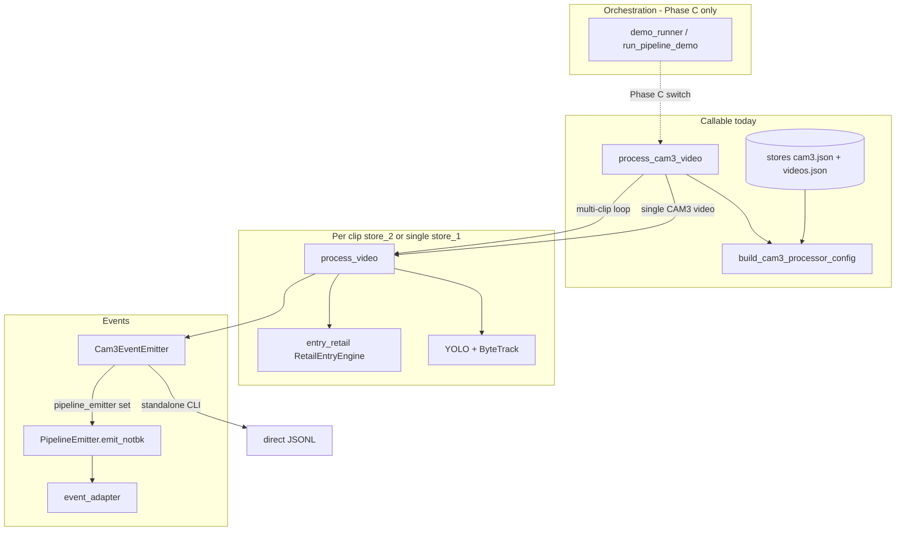

# CAM3 pre–Phase C integration

Production-capable stack in `cam3_processor.py`; orchestration still imports `entry_exit` until Phase C.

## Public API

```python
def process_cam3_video(
    video_path: Path | None = None,
    *,
    emitter: PipelineEmitter | None = None,
    show_window: bool = False,
    store: StoreConfig | None = None,
    camera_id: str | None = None,
    output_path: Path | None = None,
) -> Cam3Stats:
```

`Cam3Stats` matches `entry_exit.EntryExitStats` (`entry_count`, `exit_count`).

## Integration flow



## Clip UTC

| Key | Source |
|-----|--------|
| `CAM3` | `videos.cameras.CAM3.clip_start` |
| `CAM3:entry1` | `cam3_clips[0].clip_start` |
| `CAM3:entry2` | `cam3_clips[1].clip_start` |

`_hydrate_emitter_clip_starts()` registers these on `PipelineEmitter.clip_start_by_camera`.
`Cam3EventEmitter` uses the same map via `clip_start_by_key` for `event_datetime` in NOTEBK rows.
